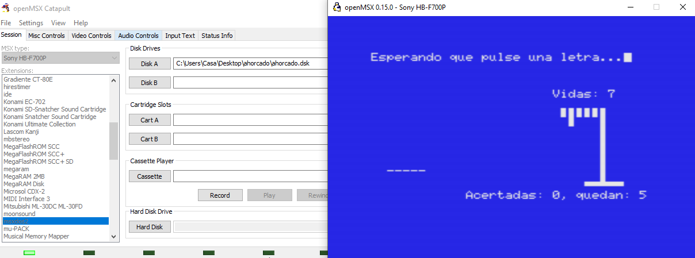

# Descripción

Ahorcado es un juego escrito en C para MSX-DOS2 que se ha escrito utilizando la librería fusion-c.
Puedes descargar el [dsk pinchando aquí](https://github.com/kikemadrigal/ahorcado/blob/master/resources/ahorcado.zip)

<!---->

El paquete lleva incluido el emulador openMSX para que tan solo tengas que poner en la ventanade comandos de windows "compil.bat main":

<!---->

## Probándo el juego con blueMSX

Necesitarás tener [está carpeta](https://github.com/kikemadrigal/ahorcado/blob/master/resources/MSX2-MSX-DOS2.zip) copiada y pegada en el directorio "machines" de tu bluemsx que si lo has instalado estrá en "C:\Program Files (x86)\blueMSX\Machines".

## Probándo el juego con openMSX
Necesitarás tener copiados y pegados todos los archivos de [este carpeta](https://github.com/kikemadrigal/ahorcado/blob/master/resources/systemroms.zip) en la carpeta systemroms de openmsx, si lo tienes instalado estará en "C:\Program Files\openMSX\share", después deberás de elegir la extensión msxdos2 de tu catapult-openmsx y pinchar en el botón Browse for disk folder (DirAsDisc) y elegir el directorio dsk:

# Reqisitos si quieres probar el código fuente

Necesitarás tener instalado el compilador sdcc en tu equipo [SDCC.es](http://sdcc.sourceforge.net/index.php#Download)

# Recursos

Aquí tienes un enlace donde están explicadas todas las funciones de fusion-c: [Fusion c](https://github.com/ericb59/Fusion-C-v1.2/blob/master/FUSION-C-Quick%20A4%201.2.pdf)